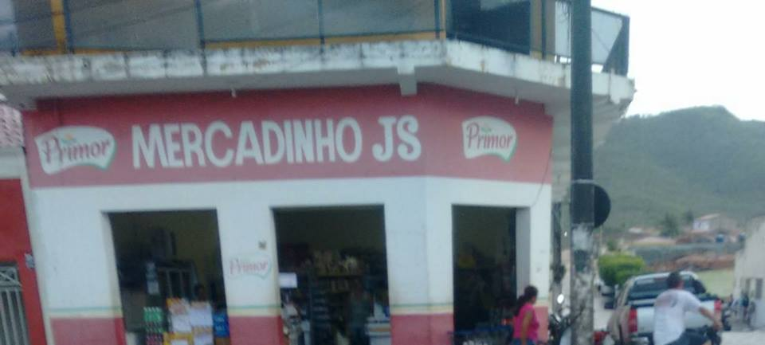

# mercadinho.js

PORRA, OUTRO FRAMEWORK!

## Install

Este é o framework mais transparente e útil do Universo: nunca mais se aborreça com dependências que quebram porque o repositório não sabe lidar com licenças ou com pessoas, updates que derrubam seu site ou código bloated que deixam seu site lento!

Apenas clone este repositório no seu servidor e todo o processo de instalação já está concluído!

## Uso

Este também é o framework menos intrusivo que existe: Não impomos à você como você deve codar em seu trabalho.

Simplesmente continue fazendo o que sempre fez - melhor impossível!

## Licença

(c) 2017 LTD. O Código (se você achar algum) está sob a GPU = General Public Unlicense:

* Você pode usar o código como quiser, desde que ache algum.
* Você pode assumir a autoria do código como quiser, desde que ache o dito cujo e tenha coragem de botar sua cara à tapa por esta merda.
* Se você disser que fui eu que escrevi esta bosta, eu processo você.
